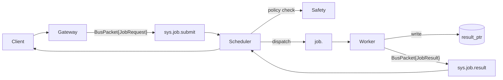
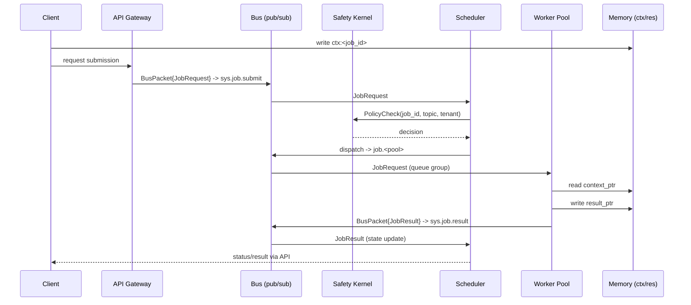

# Cortex Agent Protocol (CAP)

## TL;DR
- Cluster-native job protocol for AI agents: standard envelopes, jobs, heartbeats, and workflows over a bus.
- Keeps payloads off the wire via `context_ptr` and `result_ptr` so the bus stays lean and secure.
- Safety is built-in: schedulers call a Safety Kernel to allow/deny/throttle before dispatch.
- Works with any pub/sub that supports subjects and competing consumers (NATS by default, Kafka acceptable).
- Compatible with workers, orchestrators, gateways, schedulers, and external clients in mixed deployments.

## Status
- Protocol: CAP v0.1.0 — Draft (breaking changes still possible).
- Transport profile: NATS-first; other buses experimental.
- Reference implementation: CortexOS.

## MCP != CAP
- MCP = single-model tool protocol.
- CAP = distributed multi-agent execution protocol (scheduler + pools + safety + state machine).
- MCP focuses on tool-calling; CAP standardizes the control plane for clusters (jobs, heartbeats, workflows).

## Architecture

### Sequence (with pointers)

## Key Concepts in 60 Seconds
- **BusPacket**: single envelope for everything on the bus.
- **Jobs**: `JobRequest` (submit) + `JobResult` (complete), with workflow metadata (`workflow_id`, `parent_job_id`, `step_index`).
- **Pointers**: `context_ptr`, `result_ptr`, `redacted_context_ptr` keep the bus free of blobs.
- **Heartbeats**: worker liveness, load, pool membership, and capacity.
- **Safety Kernel**: allow/deny/human/throttle hook invoked before dispatch.
- **State machine**: `PENDING -> SCHEDULED -> DISPATCHED -> RUNNING -> {SUCCEEDED|FAILED|TIMEOUT|DENIED|CANCELLED}`.
- **Workflows**: orchestrators fan out child jobs and publish a parent result without changing the core job shape.

## Protocol Contracts
Canonical protobuf definitions live under `proto/cortex/agent/v1/`:
- `buspacket.proto` — envelope and payload selection.
- `job.proto` — job request/result messages and enums.
- `heartbeat.proto` — liveness and capacity signals.
- `safety.proto` — Safety Kernel gRPC surface.
- `alert.proto` — lightweight system alerts.

## Examples
- `examples/simple-echo/` — smallest possible job submission + result with bus messages and sequence.
- `examples/workflow-repo-review/` — parent/child workflow with aggregation.
- `examples/heartbeat.json` — standalone heartbeat sample.
- `examples/README.md` — quick pointers to all flows.

## Repo Map
- `spec/` - normative spec: envelopes, jobs, pointers, heartbeats, safety, state, workflows, transport, security.
- `proto/` - protobuf contracts (copy/paste ready).
- `examples/` - JSON and sequence flows for common scenarios.
- `tools/` - helper scripts for proto generation (optional).
- `sdk/` - starter SDKs for Go, Python, and Node/TS with NATS helpers.
- Go module path: `github.com/cortex-agent-protocol/go` (generate stubs into `generated/go` via `./tools/make_protos.sh` before tagging).

## Compatibility and Contributing
- Wire evolution is append-only: never renumber or repurpose existing protobuf fields.
- `protocol_version` (currently `1`) is used for negotiation; tag releases when message shapes change.
- See `CONTRIBUTING.md` for workflow and style guidance.

## Why CAP (and not just MCP)
- MCP assumes a single model calling local tools; it does not cover scheduling, state reconciliation, safety hooks, or distributed pools.
- CAP fixes the control-plane gaps: job lifecycle, pool routing, heartbeats, policy, and transport profile.
- MCP != CAP. They can coexist: MCP can be the tool layer inside a CAP worker.

## License
Apache-2.0 (`LICENSE`).
