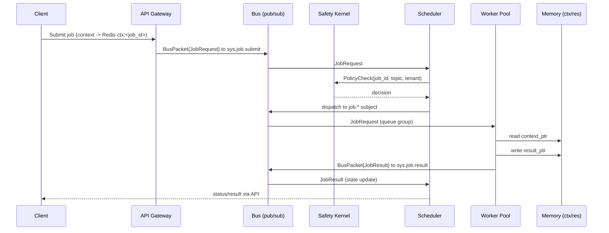

# Cortex Agent Protocol (CAP)

## TL;DR
CAP is a cluster-native AI job protocol that defines how agents (workers, orchestrators, gateways) coordinate over a bus using jobs, heartbeats, and memory pointers. CAP does for multi-agent clusters what model-centric tool-calling (e.g., MCP) does for a single LLM plus tools: it standardizes envelopes, states, and control-plane hooks.

## Why CAP?
- Existing protocols like MCP assume one model calling local tools; they don’t cover scheduling, safety, or cluster-wide state.
- AI systems at scale are distributed: many workers, shared pools, external memory, safety checks, and job state machines. CAP names those concepts and fixes the wire contract so different implementations can interoperate.

## High-level Overview

## Core Ideas
- **BusPacket envelope** for all bus traffic.
- **JobRequest / JobResult** as the unit of work and completion.
- **context_ptr / result_ptr** to external memory (keep payloads off the bus).
- **Heartbeats + pools** so schedulers can do load-aware routing.
- **Safety kernel hook** for policy decisions (allow/deny/throttle/human).
- **Job state machine** to track lifecycle end-to-end.
- **Optional workflows**: parent/child jobs driven by orchestrators.

## Relationship to implementations
CAP is implementation-agnostic. Any control plane that speaks the proto and semantics complies. A system like CortexOS can serve as a reference implementation of CAP, but CAP itself is vendor-neutral.

## Repo structure
- `spec/` — normative prose spec.
- `proto/` — canonical protobuf definitions of the wire format.
- `examples/` — message and sequence examples for common flows.
- `tools/` — helper scripts for proto generation (optional).
