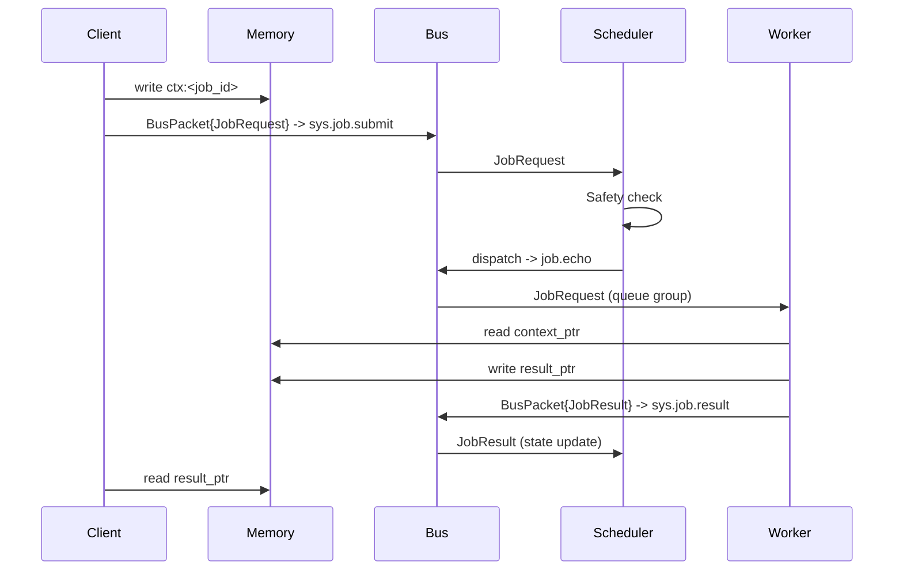

# Simple Echo Example

Scenario: A client submits a small prompt to an echo worker pool (`job.echo`) via a gateway and scheduler. Context and result live in external memory.

## Flow
1) Client writes input context to memory (e.g., Redis) under `ctx:<job_id>`.
2) Client publishes `BusPacket{JobRequest}` to `sys.job.submit`.
3) Scheduler receives the request, calls Safety Kernel, and dispatches to `job.echo` (queue group for the pool).
4) Worker consumes the job, reads `context_ptr`, writes a result to `result_ptr`, and publishes `JobResult` to `sys.job.result`.
5) Scheduler updates state; client reads the result via the pointer.

## Sequence Diagram

