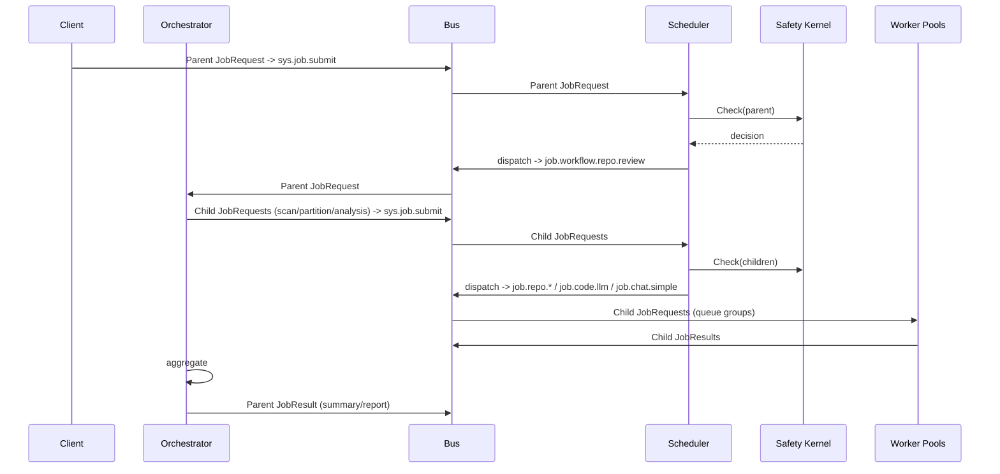

# Workflow: Repository Review

An orchestrator handles a repository review request and spawns child jobs for scanning, partitioning, analysis, and summarization.

## Flow
- Parent job subject: `job.workflow.repo.review` (handled by orchestrator pool).
- Children include:
  - `job.repo.scan`: fetch repo/archive metadata and file list.
  - `job.repo.partition`: group files into batches.
  - `job.code.llm`: analyze code batches.
  - `job.chat.simple`: produce human-readable summaries.

## Parent/Child Modeling
- Parent `JobRequest` sets `topic=job.workflow.repo.review`.
- Each child `JobRequest` sets `parent_job_id`, shares `workflow_id`, and increments `step_index`.
- Orchestrator publishes children via `sys.job.submit`; scheduler + safety treat them like any job.
- Orchestrator aggregates child `JobResult`s, writes parent `result_ptr`, and emits parent `JobResult`.

## Sequence Diagram

