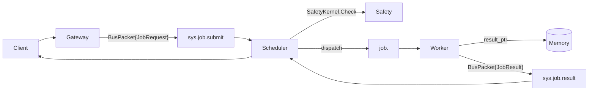

# CAP Launch Site Copy

## Hero
- Headline: “CAP: The open protocol for distributed AI agents.”
- Subhead: “Jobs, heartbeats, safety, and workflows over any bus. Keep payloads off the wire. Interoperate across gateways, schedulers, workers, and orchestrators.”
- CTA buttons: “Get the Spec” (link to `spec/00-index.md`), “Build a Worker” (link to examples), “View Protos”.

## Value Props
- **Cluster-native**: subjects, queue groups, heartbeats, and pools baked in.
- **Safe by default**: Safety Kernel hook for allow/deny/human/throttle.
- **Payload-light**: pointers keep data off the bus.
- **Workflow-ready**: parent/child jobs with traceability.
- **Vendor-neutral**: any bus, any language, Apache-2.0.

## Social Proof (placeholder)
- “Cordum: official CAP reference implementation.”
- Logos section for early adopters (to fill as they join).

## How It Works (Mermaid)

## FAQ
- **Is this MCP?** No. MCP is single-model tool calls; CAP is cluster control-plane.
- **Do I need NATS?** No, any pub/sub with subjects + competing consumers works. NATS is recommended.
- **How do I keep data secure?** Use pointers with ACLs/signed URLs; bus carries only envelopes.
- **Is there a reference implementation?** Yes: Cordum.

## Footer
- Links: Spec, Protos, Examples, GitHub, Contributing, License (Apache-2.0).
