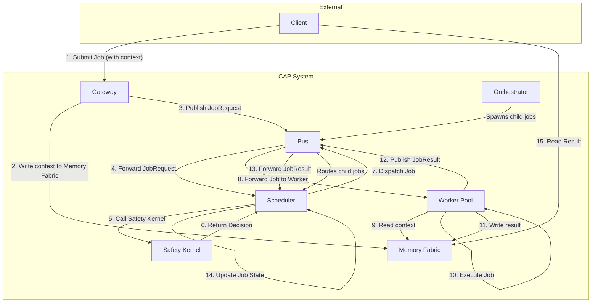

# Overview

## What CAP Is
- A distributed job protocol for AI agents that communicates over a pub/sub bus.
- Standardizes envelopes, job messages, heartbeats, and workflow metadata so schedulers, workers, orchestrators, and gateways can interoperate.
- Protocol-first: protobuf is the contract; these pages define semantics and required behavior for compatibility.

## Goals and Scope
- Enable multi-agent, multi-node execution with consistent lifecycle tracking.
- Keep payloads off the bus by mandating opaque pointers for inputs/outputs.
- Make safety and policy enforcement first-class via a dedicated hook.
- Remain transport-agnostic while providing a recommended subject profile.
- Support orchestrated workflows without changing the core job abstraction.

## Non-goals
- Not a model API or prompt format; CAP is vendor/model agnostic.
- Not a UI or product; CAP only defines the wire contract and semantics.
- Not tied to a single transport; any pub/sub with subjects/topics and queue groups works.

## Actors
- **Client**: originates work and reads results from external memory.
- **Gateway**: front-door that validates, writes context to memory, and publishes `JobRequest` packets.
- **Scheduler**: owns the state machine, calls safety, chooses pool/subject, and dispatches jobs.
- **Worker / Pool**: consumes `JobRequest` subjects, executes work, writes results, and emits `JobResult`.
- **Orchestrator**: a specialized worker that spawns child jobs and aggregates results.
- **Safety Kernel**: policy decision point (gRPC or equivalent) invoked before dispatch.
- **Memory Fabric**: external storage for context/result pointers (Redis, object storage, DB).
- **Bus**: pub/sub fabric carrying `BusPacket` envelopes.

## Architecture Diagram

## Core Abstractions
- **BusPacket**: envelope carrying trace metadata and one payload (`JobRequest`, `JobResult`, `Heartbeat`, `SystemAlert`).
- **JobRequest / JobResult**: submission and completion messages for a schedulable unit of work.
- **Pointers**: `context_ptr`, `result_ptr`, and `redacted_context_ptr` keep large payloads off the bus.
- **Heartbeats**: liveness + capacity signals for schedulers.
- **Workflow metadata**: `workflow_id`, `parent_job_id`, `step_index` enable hierarchical orchestration.

## Versioning Expectations
- Protobuf fields are append-only; never renumber existing fields.
- `protocol_version` in `BusPacket` allows producers/consumers to negotiate or reject incompatible traffic.
- Backward compatibility is required for stable interop; new fields must be optional-safe.
