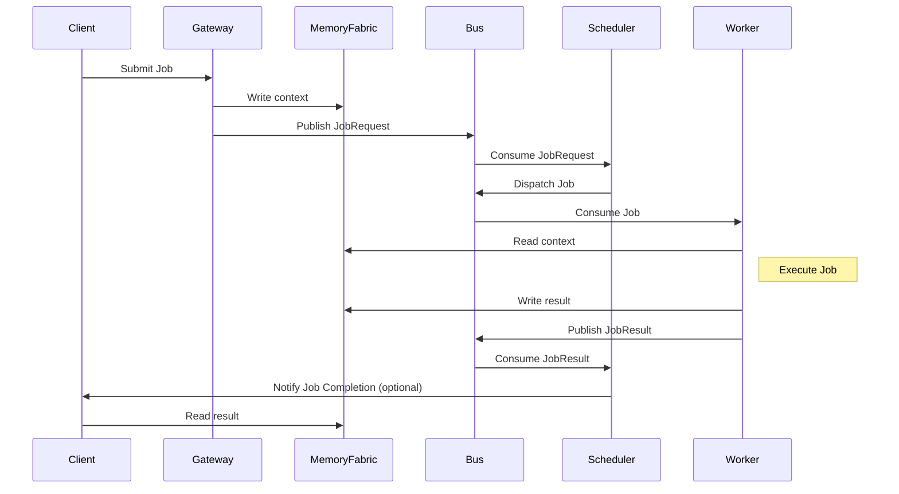

# Job Protocol

CAP jobs are the core unit of work. Gateways submit `JobRequest` packets, workers emit `JobResult`, and schedulers move jobs through the state machine.

## JobRequest Semantics
- `job_id`: globally unique, immutable identifier.
- `topic`: bus subject representing the target pool (e.g., `job.chat.simple`, `job.tools`, `job.image`).
- `priority`: scheduling hint (`INTERACTIVE`, `BATCH`, `CRITICAL`). Higher values SHOULD be dispatched before lower ones when capacity is constrained.
- `context_ptr`: opaque URI to input payload stored in external memory.
- `adapter_id`: optional specialization hint (model/tool flavor).
- `env`: key/value metadata (tenant, locale, sandbox flags, cost caps, etc.).
- `parent_job_id`, `workflow_id`, `step_index`: optional workflow metadata for orchestrators.

## JobResult Semantics
- `job_id`: MUST match the originating request.
- `status`: required lifecycle value (see `JobStatus` enum in proto).
- `result_ptr`: pointer to output payload; MAY be empty on failure but SHOULD be set when output exists.
- `worker_id`: identifier of the emitting worker.
- `execution_ms`: elapsed processing time measured by the worker.
- `error_code` / `error_message`: optional diagnostics for failures or denials.

## Job Lifecycle Diagram

## Submission Flow
1. Client writes input to external memory and obtains `context_ptr`.
2. Gateway validates, populates `job_id`, and publishes `BusPacket{JobRequest}` to `sys.job.submit`.
3. Scheduler persists `PENDING -> SCHEDULED`, calls safety, and dispatches the request to a pool subject (`job.<pool>`).
4. Worker consumes from the pool subject, reads `context_ptr`, and begins execution.

## Completion Flow
1. Worker writes output to external memory and produces `result_ptr`.
2. Worker publishes `BusPacket{JobResult}` to `sys.job.result` (and MAY also emit to `job.<pool>.result` for observability).
3. Scheduler validates correlation, updates state, and notifies external clients as needed.

## Idempotency and Retries
- Re-delivery of the same `job_id` MUST be tolerated; consumers should deduplicate via `job_id`.
- Retries SHOULD reuse the same `job_id` only if the worker behavior is idempotent; otherwise emit a new `job_id` and link via `parent_job_id`.
- JobResults for already-terminal jobs SHOULD be logged and ignored unless policy allows overrides.

## Payload Size
- Keep payloads out of the bus; use pointers for any blob larger than a few kilobytes.
- `env` keys and values SHOULD be short ASCII strings to avoid exceeding bus header limits.
