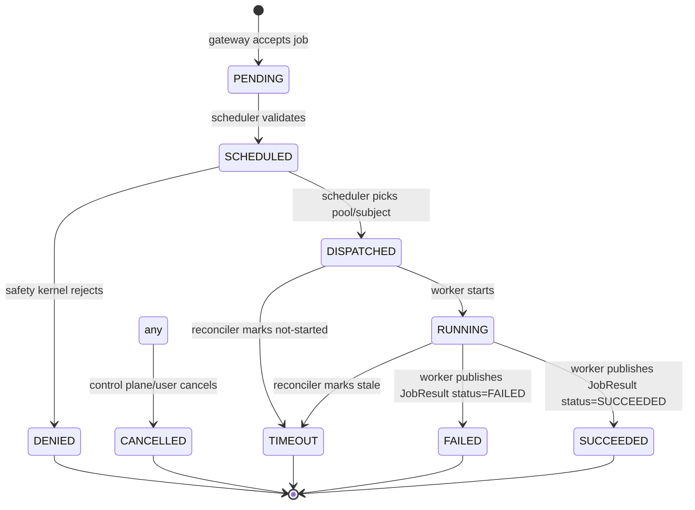

# Jobs and State Machine

## JobRequest semantics
- **job_id**: immutable identifier for the job. Must be globally unique.
- **topic**: bus subject indicating the target pool (e.g., `job.chat.simple`, `job.code.llm`).
- **priority**: hint for scheduling (interactive, batch, critical).
- **context_ptr**: opaque URI pointing to input payload in external memory.
- **adapter_id**: optional hint for model/tool specialization.
- **env**: key/value metadata (e.g., tenant, locale, sandbox flag).
- **parent_job_id / workflow_id / step_index**: optional fields used by orchestrators to express parent/child relationships and ordering.

## JobResult semantics
- **job_id**: must match the originating request.
- **status**: terminal or intermediate state result (SUCCEEDED, FAILED, CANCELLED, DENIED, TIMEOUT).
- **result_ptr**: opaque URI pointing to the output payload.
- **worker_id**: emitting worker identifier.
- **execution_ms**: elapsed processing time measured by the worker.
- **error_code / error_message**: optional diagnostic fields.

## Canonical Job State Machine

States:
- `PENDING`
- `SCHEDULED`
- `DISPATCHED`
- `RUNNING`
- `SUCCEEDED`
- `FAILED`
- `CANCELLED`
- `DENIED`
- `TIMEOUT`

Recommended transitions (append-only, no backwards moves except idempotent repeats):

## Who performs transitions
- **Gateway**: sets `PENDING` when accepting a submission.
- **Scheduler**: moves `PENDING -> SCHEDULED -> DISPATCHED` and sets `DENIED` on safety failure.
- **Worker**: moves `DISPATCHED/RUNNING -> SUCCEEDED/FAILED` and reports execution time.
- **Reconciler/Control plane**: may move jobs to `TIMEOUT` or `CANCELLED` based on policy or user action.

## Idempotency Considerations
- Setting the same state twice is allowed (idempotent), but backwards transitions should be rejected.
- A JobResult for an already terminal job should be logged but not overwrite a different terminal state unless policy allows.
- Retries should reuse the same `job_id` only if consumers handle idempotent processing; otherwise, emit a new `job_id` and link via `parent_job_id`.
