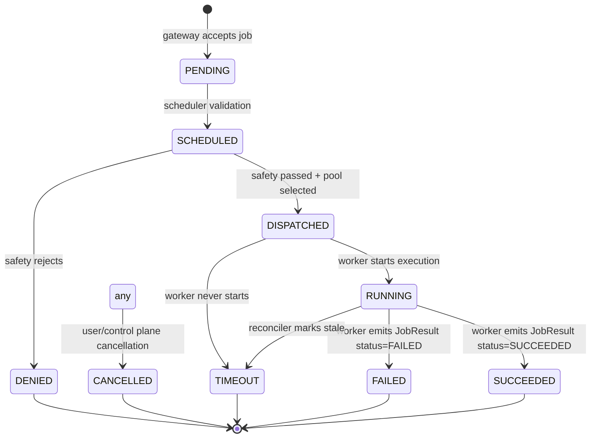

# State Machine

CAP standardizes job lifecycle states to keep schedulers and workers interoperable.

## States (from `JobStatus` enum)
- `PENDING`
- `SCHEDULED`
- `DISPATCHED`
- `RUNNING`
- `SUCCEEDED`
- `FAILED`
- `CANCELLED`
- `DENIED`
- `TIMEOUT`

## Recommended Transitions

## Responsibilities
- **Gateway**: sets `PENDING` on receipt; publishes to `sys.job.submit`.
- **Scheduler**: moves `PENDING -> SCHEDULED -> DISPATCHED`; calls safety; enforces `DENIED`.
- **Worker**: moves `DISPATCHED/RUNNING -> SUCCEEDED/FAILED`; reports `execution_ms`.
- **Controller/Reconciler**: may set `TIMEOUT` or `CANCELLED` based on SLAs or operator actions.

## Rules
- Transitions SHOULD be append-only; repeating the same state is allowed for idempotency.
- Backwards transitions (e.g., `SUCCEEDED` -> `RUNNING`) MUST be rejected.
- A `JobResult` that conflicts with an existing terminal state SHOULD be logged and ignored unless override policy is explicit.
- `CANCELLED` MAY be set from any non-terminal state.
- Timeouts SHOULD be configurable per pool or tenant.

## Metadata Expectations
- Store `context_ptr`, `result_ptr`, `worker_id`, `execution_ms`, safety decisions, and timestamps for each transition.
- Expose state transitions to clients via API/webhook so they can observe progress without polling the bus.
