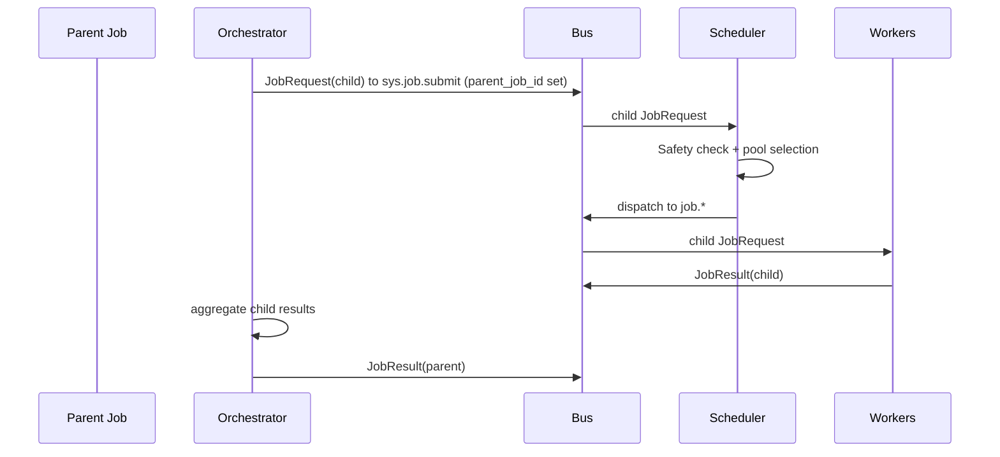

# Workflows and Orchestrators

Orchestrators are agents that consume a parent job and create child jobs to accomplish multi-step tasks. They use the same bus subjects and state machine as leaf workers.

## Modeling
- **parent_job_id**: set in each child `JobRequest` to link back to the parent.
- **workflow_id**: identifier for the overall workflow (e.g., repo-review-2025-01-10).
- **step_index**: zero- or one-based step ordering within a workflow.

## Lifecycle
1. Orchestrator consumes a parent `JobRequest` from its pool (e.g., `job.workflow.repo.review`).
2. It reads the parent context via `context_ptr`.
3. It emits child `JobRequest`s to `sys.job.submit`, setting `parent_job_id`, `workflow_id`, and `step_index`.
4. Scheduler + Safety handle each child identically to any other job.
5. Orchestrator watches child `JobResult`s (via JobStore or bus) and aggregates results.
6. Orchestrator writes the final parent result to `result_ptr` and publishes a `JobResult` for the parent.

## Sequence Example

## Rules
- Orchestrators must not bypass the scheduler: child jobs go through `sys.job.submit` and Safety Kernel.
- Parent remains open until orchestrator publishes a terminal `JobResult` for the parent.
- Orchestrators should respect backpressure and timeouts per deployment profile.
