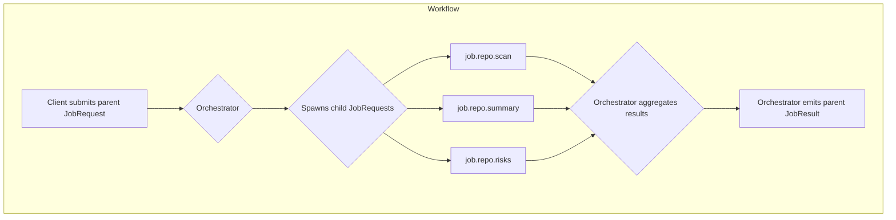

# Workflows

Workflows allow orchestrators to compose multiple jobs while keeping the core job abstraction unchanged.

## Metadata
- `workflow_id`: logical identifier for all jobs in a workflow.
- `parent_job_id`: links child jobs to the orchestrating parent.
- `step_index`: optional ordering hint for deterministic sequences.

## Pattern
1. Client submits a parent `JobRequest` with `workflow_id` set.
2. An orchestrator worker consumes the parent, expands it into child `JobRequest` messages, and publishes them with `parent_job_id` pointing to the parent.
3. Child workers emit `JobResult` events; orchestrator aggregates them.
4. Orchestrator emits a terminal `JobResult` for the parent when aggregation completes.

## Workflow Diagram

## Guarantees and Guidance
- Parent and child jobs share the same `trace_id` to preserve observability.
- Orchestrators SHOULD avoid deep nesting; prefer a shallow tree with clear `step_index` ordering.
- Child jobs MAY target different pools; schedulers treat them like any other job.
- Orchestrators SHOULD checkpoint intermediate state via pointers (manifests, partial outputs) to allow resumption.
- Cancellations SHOULD cascade: cancelling a parent SHOULD attempt to cancel active children.

## Example Subjects
- Parent submission: `sys.job.submit` -> scheduler -> `job.workflow.repo.review`.
- Child dispatch: `job.repo.scan`, `job.repo.summary`, `job.repo.risks`.
- Aggregation: orchestrator emits final result to `sys.job.result` with `job_id` of the parent.
