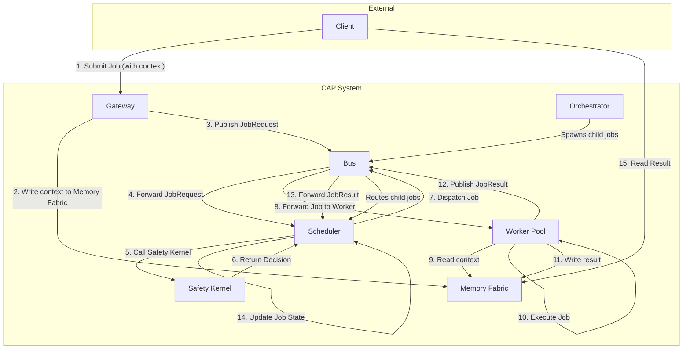

# CAP Architecture

This document provides an overview of the Cordum Agent Protocol (CAP) system architecture.

## Architecture Diagram

## Actors

*   **Client**: originates work and reads results from external memory.
*   **Gateway**: front-door that validates, writes context to memory, and publishes `JobRequest` packets.
*   **Scheduler**: owns the state machine, calls safety, chooses pool/subject, and dispatches jobs.
*   **Worker / Pool**: consumes `JobRequest` subjects, executes work, writes results, and emits `JobResult`.
*   **Orchestrator**: a specialized worker that spawns child jobs and aggregates results.
*   **Safety Kernel**: policy decision point (gRPC or equivalent) invoked before dispatch.
*   **Memory Fabric**: external storage for context/result pointers (Redis, object storage, DB).
*   **Bus**: pub/sub fabric carrying `BusPacket` envelopes.
