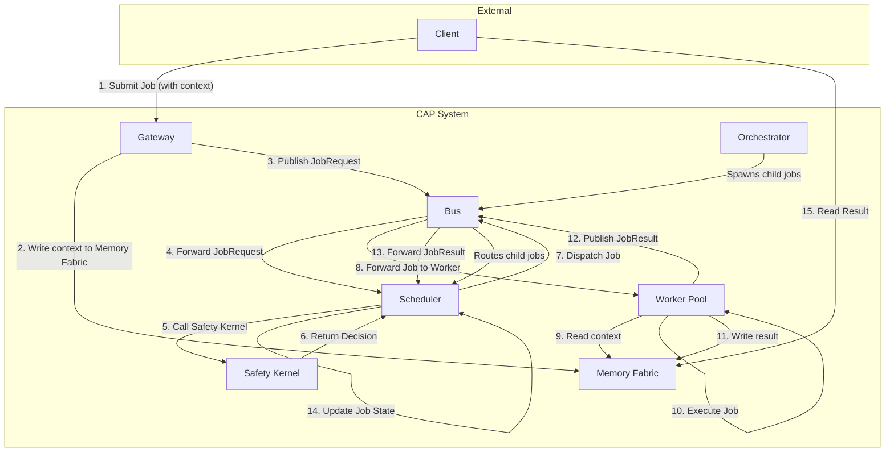
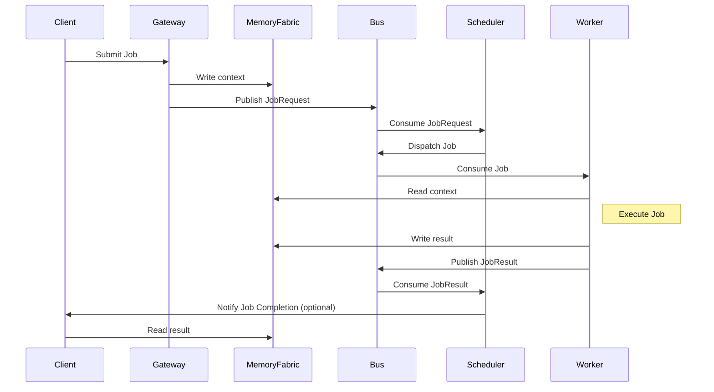
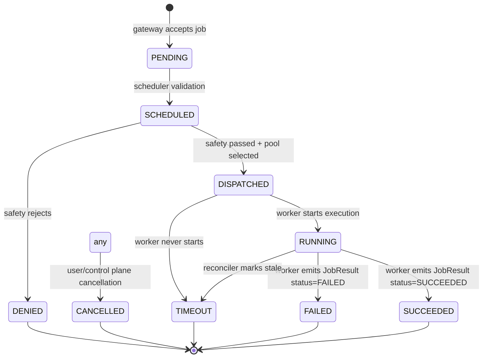
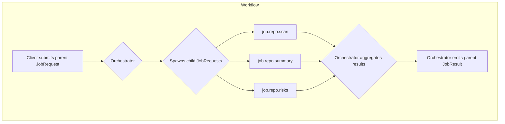

# coretex Agent Protocol - Specification Index

This folder contains the normative specification for the coretex Agent Protocol (CAP). The protobuf definitions in `proto/` are the canonical wire format; the prose here defines semantics, expectations, and recommended behaviors.

## Conformance
- RFC 2119 keywords (MUST, SHOULD, MAY, etc.) are normative.
- Compatibility is append-only: existing fields are never renumbered or repurposed.
- Implementations are compliant when they honor message shapes, state machine rules, and safety hooks defined here.

## Versioning
- `protocol_version` in `BusPacket` is used for wire negotiation. Current wire version: `1` (schema 1.0.0).
- Protobuf evolution is append-only: add new fields with new numbers; do not delete or reuse.
- Repository/SDK releases track implementation bits (Go/Python/Node/C++); pin to tags (current: `v2.0.0`) for reproducibility.
- Protocol vs SDK:
  - Protocol wire schema: 1.0.0 (stable).
  - Repository/SDK: 2.0.0 (may add helpers, docs, and generated stubs without wire breaks).

## Table of Contents
- [01 Overview](01-overview.md)
- [02 Envelope - BusPacket](02-envelope-buspacket.md)
- [03 Job Protocol](03-job-protocol.md)
- [04 Memory Pointer Spec](04-memory-pointer-spec.md)
- [04b Context and Memory Model](04b-context-and-memory.md)
- [05 Heartbeats](05-heartbeats.md)
- [06 Safety](06-safety.md)
- [07 State Machine](07-state-machine.md)
- [08 Workflows](08-workflows.md)
- [09 Transport Profile](09-transport-profile.md)
- [10 Security and Observability](10-security-observability.md)
- [11 Security Best Practices](11-security-best-practices.md)
- [12 Glossary](12-glossary.md)
# Overview

## What CAP Is
- A distributed job protocol for AI agents that communicates over a pub/sub bus.
- Standardizes envelopes, job messages, heartbeats, and workflow metadata so schedulers, workers, orchestrators, and gateways can interoperate.
- Protocol-first: protobuf is the contract; these pages define semantics and required behavior for compatibility.

## Goals and Scope
- Enable multi-agent, multi-node execution with consistent lifecycle tracking.
- Keep payloads off the bus by mandating opaque pointers for inputs/outputs.
- Make safety and policy enforcement first-class via a dedicated hook.
- Remain transport-agnostic while providing a recommended subject profile.
- Support orchestrated workflows without changing the core job abstraction.

## Non-goals
- Not a model API or prompt format; CAP is vendor/model agnostic.
- Not a UI or product; CAP only defines the wire contract and semantics.
- Not tied to a single transport; any pub/sub with subjects/topics and queue groups works.

## Actors
- **Client**: originates work and reads results from external memory.
- **Gateway**: front-door that validates, writes context to memory, and publishes `JobRequest` packets.
- **Scheduler**: owns the state machine, calls safety, chooses pool/subject, and dispatches jobs.
- **Worker / Pool**: consumes `JobRequest` subjects, executes work, writes results, and emits `JobResult`.
- **Orchestrator**: a specialized worker that spawns child jobs and aggregates results.
- **Safety Kernel**: policy decision point (gRPC or equivalent) invoked before dispatch.
- **Memory Fabric**: external storage for context/result pointers (Redis, object storage, DB).
- **Bus**: pub/sub fabric carrying `BusPacket` envelopes.

## Architecture Diagram



## Core Abstractions
- **BusPacket**: envelope carrying trace metadata and one payload (`JobRequest`, `JobResult`, `Heartbeat`, `SystemAlert`).
- **JobRequest / JobResult**: submission and completion messages for a schedulable unit of work.
- **Pointers**: `context_ptr`, `result_ptr`, and `redacted_context_ptr` keep large payloads off the bus.
- **Heartbeats**: liveness + capacity signals for schedulers.
- **Workflow metadata**: `workflow_id`, `parent_job_id`, `step_index` enable hierarchical orchestration.

## Versioning Expectations
- Protobuf fields are append-only; never renumber existing fields.
- `protocol_version` in `BusPacket` allows producers/consumers to negotiate or reject incompatible traffic.
- Backward compatibility is required for stable interop; new fields must be optional-safe.
# Envelope - BusPacket

All CAP traffic is wrapped in a `BusPacket`. The envelope provides tracing, sender identity, and protocol negotiation around a single payload.

## Required Fields
- `trace_id`: correlates all packets for a request or workflow.
- `sender_id`: stable identifier for the emitting component (gateway, scheduler, worker, orchestrator, controller).
- `created_at`: timestamp of emission.
- `protocol_version`: CAP wire version. Consumers MAY reject packets with unsupported versions.
- `payload`: exactly one of `JobRequest`, `JobResult`, `Heartbeat`, or `SystemAlert`.
- `signature` (optional but recommended): digital signature of the serialized `BusPacket` for authenticity and integrity.

## Canonical Proto (see `proto/coretex/agent/v1/buspacket.proto`)
```proto
message BusPacket {
  string trace_id = 1;
  string sender_id = 2;
  google.protobuf.Timestamp created_at = 3;
  int32 protocol_version = 4;

  oneof payload {
    JobRequest job_request = 10;
    JobResult job_result = 11;
    Heartbeat heartbeat = 12;
    SystemAlert alert = 13;
  }

  bytes signature = 14; // digital signature of the serialized BusPacket
}
```

## Subject Recommendations
- Submission: publish `BusPacket{JobRequest}` to `sys.job.submit`.
- Results: publish `BusPacket{JobResult}` to `sys.job.result`.
- Heartbeats: publish `BusPacket{Heartbeat}` to `sys.heartbeat` (often with queue groups disabled so all schedulers can see them).
- Alerts: publish `BusPacket{SystemAlert}` to `sys.alert`.
- Work pools: workers subscribe to `job.<pool>` subjects (e.g., `job.code.llm`, `job.tools`, `job.image`).

## Envelope Rules
- Field numbers MUST NOT be renumbered; evolve by adding new fields.
- All timestamps SHOULD be UTC.
- Producers SHOULD set `protocol_version = 1` until a new major is defined.
- Consumers SHOULD treat unknown fields as optional and ignore them.
- Bus-level metadata (headers) MAY be used for auth or routing, but message-level fields remain canonical.
- When signatures are enabled, verify the signature with the field cleared before trusting the packet.
# Job Protocol

CAP jobs are the core unit of work. Gateways submit `JobRequest` packets, workers emit `JobResult`, and schedulers move jobs through the state machine.

## JobRequest Semantics
- `job_id`: globally unique, immutable identifier.
- `topic`: bus subject representing the target pool (e.g., `job.chat.simple`, `job.tools`, `job.image`).
- `priority`: scheduling hint (`INTERACTIVE`, `BATCH`, `CRITICAL`). Higher values SHOULD be dispatched before lower ones when capacity is constrained.
- `context_ptr`: opaque URI to input payload stored in external memory.
- `memory_id`: logical corpus identifier (`repo:foo/bar`, `chat:session-123`, `kb:incident-42`) used for retrieval.
- `context_hints`: optional hints for retrieval/summarization (token budgets, allow_summarization, allow_retrieval, tags).
- `adapter_id`: optional specialization hint (model/tool flavor).
- `budget`: soft execution limits (input/output/total tokens, deadline_ms).
- `env`: key/value metadata (locale, sandbox flags, etc.).
- `tenant_id`, `principal_id`: multi-tenant identities for policy/audit.
- `labels`: arbitrary routing/placement metadata (environment, project, compliance flags).
- `parent_job_id`, `workflow_id`, `step_index`: optional workflow metadata for orchestrators.

## JobResult Semantics
- `job_id`: MUST match the originating request.
- `status`: required lifecycle value (see `JobStatus` enum in proto).
- `result_ptr`: pointer to output payload; MAY be empty on failure but SHOULD be set when output exists.
- `worker_id`: identifier of the emitting worker.
- `execution_ms`: elapsed processing time measured by the worker.
- `error_code` / `error_message`: optional diagnostics for failures or denials.

## Job Lifecycle Diagram



## Submission Flow
1. Client writes input to external memory and obtains `context_ptr`.
2. Gateway validates, populates `job_id`, and publishes `BusPacket{JobRequest}` to `sys.job.submit`.
3. Scheduler persists `PENDING -> SCHEDULED`, calls safety, and dispatches the request to a pool subject (`job.<pool>`).
4. Worker consumes from the pool subject, reads `context_ptr`, and begins execution (optionally using `memory_id` and `context_hints` for retrieval/summarization).

## Completion Flow
1. Worker writes output to external memory and produces `result_ptr`.
2. Worker publishes `BusPacket{JobResult}` to `sys.job.result` (and MAY also emit to `job.<pool>.result` for observability).
3. Scheduler validates correlation, updates state, and notifies external clients as needed.

## Idempotency and Retries
- Re-delivery of the same `job_id` MUST be tolerated; consumers should deduplicate via `job_id`.
- Retries SHOULD reuse the same `job_id` only if the worker behavior is idempotent; otherwise emit a new `job_id` and link via `parent_job_id`.
- JobResults for already-terminal jobs SHOULD be logged and ignored unless policy allows overrides.

## Tracing and Relationships
- `trace_id` in `BusPacket` MUST remain stable across an entire workflow tree; orchestrators SHOULD reuse the parent `trace_id` when fanning out.
- `workflow_id`, `parent_job_id`, and `step_index` SHOULD be populated by orchestrators to describe the DAG; schedulers/workers SHOULD propagate these values unchanged.
- Observability backends MAY build a trace graph from (`job_id`, `parent_job_id`, `workflow_id`, `step_index`) without inspecting payloads.

## Payload Size
- Keep payloads out of the bus; use pointers for any blob larger than a few kilobytes.
- `env` keys and values SHOULD be short ASCII strings to avoid exceeding bus header limits.
# Memory Pointer Spec

CAP keeps payloads off the bus by referencing external memory through opaque pointers.

## Pointer Types
- `context_ptr`: location of input payload written by the gateway or client.
- `result_ptr`: location of output payload written by the worker or orchestrator.
- `redacted_context_ptr`: optional sanitized input produced by the Safety Kernel on deny/throttle.

## Format
- Pointers are opaque URIs: examples include `redis://ctx/<job_id>`, `s3://bucket/key`, `file:///var/cap/ctx/job-id`, `https://object-store/...`.
- Consumers MUST treat pointers as opaque; dereferencing is implementation-specific.
- Pointers SHOULD be stable and immutable for the lifetime of the job.

## Size and Encoding
- Inputs/outputs SHOULD be stored as UTF-8 text or binary blobs; CAP does not mandate schema.
- For structured data, JSON or MsgPack are recommended for portability.
- Large artifacts (models, archives) SHOULD be chunked and referenced by manifest to avoid enormous single objects.

## TTL and Retention
- Gateways SHOULD set TTL on `context_ptr` objects based on workload (minutes to hours).
- Workers SHOULD set TTL on `result_ptr` objects (hours to days) to allow downstream consumption.
- Reapers MAY garbage-collect expired pointers; CAP does not prescribe retention policies.

## Integrity and Access Control
- Implementations SHOULD authenticate/authorize access to pointer locations (e.g., scoped Redis credentials, signed URLs).
- Pointers SHOULD NOT include secrets inline; prefer bearer tokens or signed URLs with short expiry.
- When redaction occurs, `redacted_context_ptr` SHOULD point to a sanitized copy with the same TTL policy as the original.
# Context and Memory Model

CAP treats context as a first-class concern: jobs point to external memory instead of embedding payloads, and workers may retrieve/summarize context based on hints provided in `JobRequest`.

## Logical Memory
- `memory_id` identifies the logical corpus for a job (e.g., `repo:foo/bar`, `chat:session-123`, `kb:incident-42`).
- Gateways SHOULD set `memory_id` when the job is tied to a durable corpus; workers MAY use it to drive retrieval or caching.

## Pointers (recap)
- `context_ptr`: pointer to input payload (written by client/gateway).
- `result_ptr`: pointer to output payload (written by worker/orchestrator).
- `redacted_context_ptr`: sanitized input (written by Safety Kernel when redaction is applied).
- Pointers are opaque URIs (`redis://ctx/<job_id>`, `s3://bucket/key`, `vector://kb/<id>`); consumers MUST NOT assume storage details.

## Context Hints
`JobRequest.context_hints` communicates how context should be handled:
- `max_input_tokens`: budget for input tokens per model call.
- `allow_summarization`: worker MAY summarize context to fit budgets.
- `allow_retrieval`: worker MAY perform retrieval over `memory_id` instead of using `context_ptr` verbatim.
- `tags`: optional labels to scope retrieval (`logs`, `code`, `prod`, etc.).

Workers SHOULD respect these hints when deciding whether to load context, retrieve from a memory fabric, or summarize before tool/model execution.

## Memory Fabric Expectations
- Memory backends (Redis, object storage, vector DBs) are outside CAP’s wire contract but MUST be addressable via pointers.
- TTLs and retention are implementation-defined; gateways/workers SHOULD set TTLs appropriate to workload and tenant policy.
- Access control applies at pointer targets: keep credentials scoped; prefer signed URLs or per-tenant tokens.

## Redaction and Safety
- When the Safety Kernel redacts input, it SHOULD write `redacted_context_ptr` and set policy reason in the safety response.
- Workers and schedulers SHOULD prefer `redacted_context_ptr` over `context_ptr` when present.
# Heartbeats

Heartbeats advertise worker liveness, capacity, and pool membership so schedulers can route jobs intelligently.

## Semantics
- `worker_id`: stable identity for the worker process.
- `region`: location hint (region/zone/cluster) for locality-aware scheduling.
- `type`: capability class (cpu, gpu, cpu-tools, gpu-code, etc.).
- `cpu_load` / `gpu_utilization`: utilization percentages (0-100).
- `active_jobs`: number of in-flight jobs on the worker.
- `capabilities`: freeform skills/tools supported (e.g., `python`, `browser`, `embedding`).
- `pool`: pool/subject this worker consumes (e.g., `job.code.llm`).
- `max_parallel_jobs`: advertised concurrency limit.
- `labels`: optional placement/routing metadata (e.g., `region`, `compliance`, `runtime`).

## Emission Rules
- Default interval SHOULD be 2-5 seconds; set lower for latency-sensitive pools.
- Heartbeats SHOULD be sent even when idle so schedulers can detect zero-load pools.
- Workers SHOULD stop heartbeats immediately before planned shutdown to allow drain.
- Heartbeats SHOULD be published to `sys.heartbeat` without queue groups so all schedulers/controllers see them.

## Scheduler Behavior
- Treat absent heartbeats as worker loss after a grace window (e.g., 3x interval).
- Prefer workers with lower `active_jobs` and utilization when dispatching.
- Respect `max_parallel_jobs` to avoid overload; pause dispatch when active count meets or exceeds the limit.
- Use `capabilities`/`type` to honor pool-specific requirements (GPU-only pools, tool availability, etc.).
# Safety

CAP makes safety a first-class control-plane hook via the Safety Kernel.

## Decision Model
- Outcomes: `ALLOW`, `DENY`, `REQUIRE_HUMAN`, `THROTTLE`.
- Inputs: `job_id`, `topic`, `tenant`, `principal_id`, `priority`, `budget`, optional `estimated_cost`, `labels`, `memory_id`, and optional `effective_config` (marshaled EffectiveConfig).
- Outputs: decision, human-readable `reason`, and optional `redacted_context_ptr`.

## Canonical Service (see `proto/coretex/agent/v1/safety.proto`)
```proto
service SafetyKernel {
  rpc Check(PolicyCheckRequest) returns (PolicyCheckResponse);
}
```

## Scheduler/Gateway Requirements
- Call SafetyKernel before dispatching a `JobRequest` into a pool subject.
- If `DENY`, set job state to `DENIED` and emit a `JobResult` with `status=JOB_STATUS_DENIED` and an error message.
- If `REQUIRE_HUMAN`, pause dispatch and surface state to the client; allow an out-of-band approval path to resume.
- If `THROTTLE`, delay or queue based on policy; retry the check after the backoff window.
- If `redacted_context_ptr` is provided, schedulers SHOULD dispatch using the redacted pointer in place of the original.

## Performance and Reliability
- Safety checks SHOULD complete quickly (<250ms) to avoid head-of-line blocking.
- Cache positive decisions when appropriate, keyed by `tenant+topic+adapter_id+priority`.
- On SafetyKernel outage, schedulers MAY fail-closed (preferred) or fail-open by explicit operator policy; the chosen behavior MUST be documented.

## Auditing
- Log every decision with `trace_id`, `job_id`, `decision`, and `reason` for downstream observability and compliance.
- Include the safety decision in job metadata for later reconciliation.
# State Machine

CAP standardizes job lifecycle states to keep schedulers and workers interoperable.

## States (from `JobStatus` enum)
- `PENDING`
- `SCHEDULED`
- `DISPATCHED`
- `RUNNING`
- `SUCCEEDED`
- `FAILED`
- `CANCELLED`
- `DENIED`
- `TIMEOUT`

## Recommended Transitions


## Responsibilities
- **Gateway**: sets `PENDING` on receipt; publishes to `sys.job.submit`.
- **Scheduler**: moves `PENDING -> SCHEDULED -> DISPATCHED`; calls safety; enforces `DENIED`.
- **Worker**: moves `DISPATCHED/RUNNING -> SUCCEEDED/FAILED`; reports `execution_ms`.
- **Controller/Reconciler**: may set `TIMEOUT` or `CANCELLED` based on SLAs or operator actions.

## Rules
- Transitions SHOULD be append-only; repeating the same state is allowed for idempotency.
- Backwards transitions (e.g., `SUCCEEDED` -> `RUNNING`) MUST be rejected.
- A `JobResult` that conflicts with an existing terminal state SHOULD be logged and ignored unless override policy is explicit.
- `CANCELLED` MAY be set from any non-terminal state.
- Timeouts SHOULD be configurable per pool or tenant.

## Metadata Expectations
- Store `context_ptr`, `result_ptr`, `worker_id`, `execution_ms`, safety decisions, and timestamps for each transition.
- Expose state transitions to clients via API/webhook so they can observe progress without polling the bus.
# Workflows

Workflows allow orchestrators to compose multiple jobs while keeping the core job abstraction unchanged.

## Metadata
- `workflow_id`: logical identifier for all jobs in a workflow.
- `parent_job_id`: links child jobs to the orchestrating parent.
- `step_index`: optional ordering hint for deterministic sequences.

## Pattern
1. Client submits a parent `JobRequest` with `workflow_id` set.
2. An orchestrator worker consumes the parent, expands it into child `JobRequest` messages, and publishes them with `parent_job_id` pointing to the parent.
3. Child workers emit `JobResult` events; orchestrator aggregates them.
4. Orchestrator emits a terminal `JobResult` for the parent when aggregation completes.

## Workflow Diagram



## Guarantees and Guidance
- Parent and child jobs share the same `trace_id` to preserve observability.
- Orchestrators SHOULD avoid deep nesting; prefer a shallow tree with clear `step_index` ordering.
- Child jobs MAY target different pools; schedulers treat them like any other job.
- Orchestrators SHOULD checkpoint intermediate state via pointers (manifests, partial outputs) to allow resumption.
- Cancellations SHOULD cascade: cancelling a parent SHOULD attempt to cancel active children.

## Example Subjects
- Parent submission: `sys.job.submit` -> scheduler -> `job.workflow.repo.review`.
- Child dispatch: `job.repo.scan`, `job.repo.summary`, `job.repo.risks`.
- Aggregation: orchestrator emits final result to `sys.job.result` with `job_id` of the parent.
# Transport Profile

CAP is transport-agnostic but assumes a pub/sub fabric with subjects/topics and queue groups (competing consumers). This profile provides a recommended mapping for common transports.

## Subject/Topic Conventions
- Submission: `sys.job.submit`
- Results: `sys.job.result`
- Heartbeats: `sys.heartbeat`
- Alerts: `sys.alert`
- Work pools: `job.<pool>` (e.g., `job.code.llm`, `job.tools`, `job.image`)

## NATS Profile (recommended default)
- Use queue groups for pool subjects so multiple workers share load.
- Disable queue groups for `sys.heartbeat` so all schedulers see all heartbeats.
- Enable JetStream (or equivalent) for durability on `sys.job.submit` and `sys.job.result` when jobs are long-running or high-value.
- Assume at-least-once delivery; workers and schedulers MUST be idempotent on (`job_id`, pointers).
- Ack on successful handling; prefer pull/flow-control when the pool is large to avoid overload.
- Prefer small message bodies; large payloads must stay behind pointers.

## Kafka Profile (alternative)
- Map subjects to topics with a prefix (`cap.sys.job.submit`, `cap.job.code.llm`).
- Use consumer groups to represent pools.
- Deduplicate via `job_id` because Kafka provides at-least-once under failures.

## Delivery Expectations
- At-least-once delivery MUST be assumed; duplicate suppression belongs to consumers.
- Ordering is not guaranteed across partitions/subjects; state transitions must be idempotent.
- Producers SHOULD set reasonable timeouts and retries on publish; consumers SHOULD handle transient failures.
- Retry strategy: re-publish with the same `job_id` only if the workload is idempotent; otherwise create a new job and link via `parent_job_id`.
- Idempotency guidance: treat `job_id + result_ptr` as the idempotency key and avoid side effects if a result already exists.

## Security at Transport Layer
- Use TLS for all bus connections.
- Require authentication for publishers and subscribers; map identities to `sender_id`.
- Authorize subjects per role: gateways may publish submit; workers subscribe to pools; schedulers subscribe to submit/result.
# Security and Observability

Security and visibility are mandatory for production deployments of CAP. For a more detailed guide to security best practices, see [11 Security Best Practices](11-security-best-practices.md).

## Authentication and Authorization
- Bus connections MUST be authenticated (mTLS, tokens) and authorized per subject.
- `sender_id` SHOULD map to an authenticated principal for auditability.
- Gateways SHOULD validate client identity before accepting submissions.

## Data Protection
- Keep payloads out of the bus; pointers SHOULD reference data protected by access control (scoped tokens, signed URLs, or per-tenant credentials).
- Encrypt data at rest in the memory fabric when supported by the backend.
- Avoid embedding secrets in pointers or `env`; use short-lived credentials instead.

## Safety and Privacy
- Use the Safety Kernel for policy enforcement (deny, throttle, human-review).
- Redact or hash sensitive fields in logs; prefer `redacted_context_ptr` for sanitized copies.

## Observability
- Metrics: emit counters for submissions, dispatches, successes, failures, denials, timeouts, and safety decisions; track latency buckets for submission->dispatch and dispatch->result.
- Tracing: propagate a stable `trace_id` across gateway, scheduler, worker, and orchestrator spans; child jobs SHOULD reuse the parent `trace_id`.
- Workflow topology: include `workflow_id`, `parent_job_id`, and `step_index` as attributes to reconstruct DAGs without inspecting payloads.
- Logging: log state transitions with `job_id`, `trace_id`, `status`, `worker_id`, `pool`, `decision`, and `latency_ms`.
- Heartbeat monitoring: alert on missing heartbeats per pool/region; track utilization trends.

## Compliance and Retention
- Configure TTLs for contexts/results per tenant; purge expired data regularly.
- Keep audit logs of safety decisions and job state transitions for a policy-defined retention window.
# Security Best Practices

This document provides a comprehensive overview of security best practices for implementing and deploying the coretex Agent Protocol (CAP). These recommendations are intended to supplement the baseline security requirements outlined in `10-security-observability.md`.

## Threat Model

A detailed threat model is crucial for securing any distributed system. The following is a non-exhaustive list of potential threats to a CAP deployment and recommended mitigations.

| Threat | Description | Mitigation |
| --- | --- | --- |
| **Message Spoofing** | A malicious actor on the bus impersonates a legitimate component (e.g., a worker spoofing a scheduler). | Use digital signatures for `BusPacket` envelopes. |
| **Message Tampering** | A malicious actor modifies a message in transit. | Use digital signatures for `BusPacket` envelopes and TLS for the transport layer. |
| **Unauthorized Job Execution** | A malicious actor submits a job they are not authorized to run. | Gateways MUST authenticate and authorize clients. Schedulers MUST verify job provenance. |
| **Data Exfiltration** | A malicious actor gains access to sensitive data in the memory fabric. | Use end-to-end encryption for payloads. Enforce strict access control on the memory fabric. |
| **Denial of Service (DoS)** | A malicious actor floods the system with jobs or heartbeats, overwhelming components. | Implement rate limiting at the gateway and on the bus. Schedulers should monitor for resource abuse. |
| **Malicious Payloads** | A malicious actor submits a job with a payload designed to exploit a vulnerability in a worker. | Gateways and workers MUST validate and sanitize inputs. Run workers in sandboxed environments. |
| **Component Compromise** | A legitimate component (e.g., a worker) is compromised and begins to act maliciously. | Implement the principle of least privilege. Workers should have limited access to the bus and memory fabric. Monitor for anomalous behavior. |

## End-to-End Encryption of Payloads

While transport-level encryption (TLS) protects data in transit on the bus, the payloads stored in the memory fabric are not encrypted by the protocol itself. For sensitive data, we strongly recommend end-to-end encryption of payloads.

- **Mechanism:** Before writing a payload to the memory fabric, the client or gateway should encrypt it using a symmetric key. The key should be managed by a Key Management System (KMS). The `context_ptr` would then point to the encrypted payload. The worker would fetch the encrypted payload, retrieve the key from the KMS, and decrypt the payload.
- **Key Management:** Use a KMS (e.g., HashiCorp Vault, AWS KMS, Google Cloud KMS) to manage encryption keys. Access to keys should be strictly controlled and audited.
- **Key Scoping:** Keys should be scoped as narrowly as possible, for example, per-tenant or per-job.

## Digital Signatures for BusPackets

To prevent message spoofing and tampering, all `BusPacket` envelopes SHOULD be digitally signed.

- **Mechanism:** `BusPacket` includes a `signature` field. The sender serializes the packet with `signature` cleared, signs the serialized data with its private key, and then sets the `signature` field. The receiver clears the field, recomputes the hash, and verifies the signature using the sender's public key.

```proto
message BusPacket {
  string trace_id = 1;
  string sender_id = 2;
  google.protobuf.Timestamp created_at = 3;
  int32 protocol_version = 4;

  oneof payload {
    JobRequest job_request = 10;
    JobResult job_result = 11;
    Heartbeat heartbeat = 12;
    SystemAlert alert = 13;
  }
  
  bytes signature = 14; // Digital signature of the serialized BusPacket
}
```

- **Public Key Distribution:** Public keys of trusted components must be distributed securely. This can be done through a configuration management system or a dedicated key distribution service.

## Detailed Safety Kernel Interaction

The Safety Kernel is a critical component for policy enforcement. To enable more sophisticated policies, the `PolicyCheckRequest` should include as much context as possible.

- **Recommended `PolicyCheckRequest` Fields:**
  - `job_id`, `topic`, `tenant`, `principal_id`, `priority`, `estimated_cost`
  - `budget`, `labels`, `memory_id`
  - `effective_config` (marshaled EffectiveConfig for the resolved context)

## Input Validation

All inputs from external sources must be validated and sanitized.

- **Gateway:**
  - Validate the format of the `context_ptr` to ensure it's a valid URI for the configured memory fabric.
  - Sanitize all fields in the `JobRequest` to prevent injection attacks (e.g., XSS, SQLi) if these fields are used to construct queries or displayed in UIs.
  - Enforce size limits on `env` metadata.
- **Worker:**
  - Never trust the content of the `context_ptr`.
  - If the payload is in a structured format (e.g., JSON), validate it against a schema.
  - If the payload is executable code, run it in a sandboxed environment.

## Rate Limiting and Resource Abuse

To protect the system from being overwhelmed, implement rate limiting at multiple levels.

- **Gateway:**
  - Limit the number of job submissions per client / per IP address.
- **Bus:**
  - If the bus supports it, configure rate limits on subjects.
- **Scheduler:**
  - Monitor the number of jobs per tenant and enforce quotas.
  - Monitor worker heartbeats and detect anomalous behavior (e.g., a worker that is always busy).

## Principle of Least Privilege

Components should only have the permissions they need to perform their function.

- **Workers:** A worker should only be able to subscribe to its designated pool subject and publish to the `sys.job.result` subject. It should only have access to the specific memory locations for the jobs it's processing.
- **Gateways:** A gateway should only be able to publish to the `sys.job.submit` subject.
- **Schedulers:** A scheduler needs broader permissions, but these should still be carefully scoped.
# Glossary

This document defines key terms used in the coretex Agent Protocol (CAP) specification.

| Term | Definition |
| --- | --- |
| **Adapter** | A component that adapts a specific model or tool to the CAP worker interface. The `adapter_id` in a `JobRequest` can be used to select a specific adapter. |
| **Bus** | The pub/sub message-passing fabric that transports `BusPacket` envelopes between CAP components. |
| **BusPacket** | The standard envelope for all messages on the bus. It contains metadata like `trace_id` and `sender_id`, and a payload. |
| **Client** | The application or service that originates a job request. |
| **Context Pointer** | An opaque URI (`context_ptr`) that points to the input data for a job, stored in the Memory Fabric. |
| **Gateway** | The entry point for job requests into the CAP system. It validates requests, writes job contexts to the Memory Fabric, and publishes `JobRequest` packets to the bus. |
| **Heartbeat** | A periodic message sent by workers to advertise their liveness, capacity, and capabilities. |
| **Job** | The fundamental unit of work in CAP. It is represented by a `JobRequest` and a `JobResult`. |
| **JobRequest** | A message that initiates a job. It contains metadata about the job, including its topic, priority, and a pointer to its context. |
| **JobResult** | A message that indicates the completion of a job. It contains the job's final status and a pointer to its result. |
| **Memory Fabric** | An external storage system (e.g., Redis, S3, a database) used to store large data payloads (job contexts and results) that are referenced by pointers in CAP messages. |
| **Orchestrator** | A specialized worker that can break down a complex job into a workflow of smaller child jobs. |
| **Pool** | A group of workers that subscribe to the same job topic and have similar capabilities. |
| **Result Pointer** | An opaque URI (`result_ptr`) that points to the output data of a job, stored in the Memory Fabric. |
| **Safety Kernel** | A centralized service that enforces policies on jobs before they are dispatched. It can allow, deny, or throttle jobs based on configurable rules. |
| **Scheduler** | The component responsible for managing the job lifecycle. It consumes `JobRequest` and `JobResult` messages, calls the Safety Kernel, and dispatches jobs to worker pools. |
| **State Machine** | The set of states that a job can be in (e.g., `PENDING`, `RUNNING`, `SUCCEEDED`, `FAILED`). |
| **Worker** | A component that executes jobs. It subscribes to a job topic, processes `JobRequest` messages, and produces `JobResult` messages. |
| **Workflow** | A set of interconnected jobs, managed by an Orchestrator, that together accomplish a larger task. |
